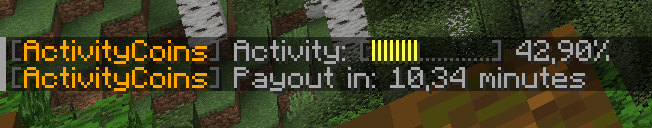

# ActivityCoins

ActivityCoins is a plugin for Minecraft servers. With ActivityCoins you'll get rewarded for in-game activity. Players
will get paid based on their activity in a configurable interval. This plugin was originally developed in 2016 for Cube
Legends and Mining Heroes.

The following activities are tracked:

* Breaking blocks (survival & creative)
* Placing blocks (survival & creative)
* Chatting (survival & creative)
* Using commands (survival & creative)
* Fishing (survival)
* Killing mobs (survival)

## Usage

### Commands and permissions

| Command         | Permission          | Description                            |
|-----------------|---------------------|----------------------------------------|
| `/activity`     | `activitycoins.own` | Display current (own) activity         |
| `/activity all` | `activitycoins.all` | Display activity of all online players |

### Configuration properties

| Property                   | Description                                                   |
|----------------------------|---------------------------------------------------------------|
| `interval`                 | Payout interval in minutes                                    |
| `blockHistorySize`         | History size for previously placed / broken blocks per player |
| `worth.blockBreakSurvival` | Worth for breaking blocks in survival mode                    |
| `worth.blockBreakCreative` | Worth for breaking blocks in creative mode                    |
| `worth.blockPlaceSurvival` | Worth for placing blocks in survival mode                     |
| `worth.blockPlaceCreative` | Worth for placing blocks in creative mode                     |
| `worth.chat`               | Worth for chatting                                            |
| `worth.command`            | Worth for using commands                                      |
| `worth.fishing`            | Worth for fishing                                             |
| `worth.kill`               | Worth for killing mobs                                        |
| `worth.max`                | Worth which stands for 100% activity                          |
| `income.min`               | Income for 0% activity                                        |
| `income.max`               | Income for 100% activity                                      |
| `logging`                  | Enable or disable logging                                     |
| `announce`                 | Enable or disable payout announcements                        |
| `language`                 | Language file to use                                          |
| `worlds`                   | Worlds on which the activity should be tracked                |
